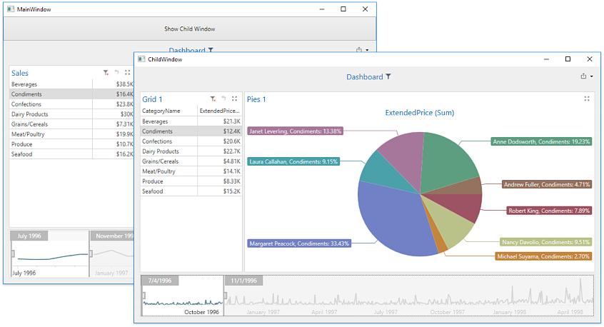

<!-- default badges list -->

<!-- default badges end -->
# Dashboard for WPF - How to Synchronize Master Filter and Drill Down Actions Between Dashboards

This example demonstrates how to synchronize Master Filter and Drill-Down actions between different dashboards.

The main form contains the [DashboardControl](https://docs.devexpress.com/Dashboard/DevExpress.DashboardWpf.DashboardControl) with a loaded sample dashboard. The _Show Child Window_ button  invokes another window containing the **DashboardControl** with a different dashboard.

[Master Filtering and Drill-Down](https://docs.devexpress.com/Dashboard/400011/building-the-designer-and-viewer-applications/wpf-viewer/manage-interactivity-capabilities) and 
actions performed in the main window are applied to the child window.

To accomplish this, the child window subscribes to the following events of the main window's **DashboardControl**:

- [DashboardControl.MasterFilterSet](https://docs.devexpress.com/Dashboard/DevExpress.DashboardWpf.DashboardControl.MasterFilterSet)
- [DashboardControl.MasterFilterCleared](https://docs.devexpress.com/Dashboard/DevExpress.DashboardWpf.DashboardControl.MasterFilterCleared)
- [DashboardControl.DrillDownPerformed](https://docs.devexpress.com/Dashboard/DevExpress.DashboardWpf.DashboardControl.DrillDownPerformed)
- [DashboardControl.DrillUpPerformed](https://docs.devexpress.com/Dashboard/DevExpress.DashboardWpf.DashboardControl.DrillUpPerformed)

When an event occurs, the following methods are used to apply filter values to the child window's **DashboardViewer** control or to perform the data drill-down or drill-up operations:

- [DashboardControl.SetMasterFilter](https://docs.devexpress.com/Dashboard/DevExpress.DashboardWpf.DashboardControl.SetMasterFilter(System.String-System.Object))
- [DashboardControl.SetRange](https://docs.devexpress.com/Dashboard/DevExpress.DashboardWpf.DashboardControl.SetRange(System.String-DevExpress.DashboardCommon.RangeFilterSelection))
- [DashboardControl.PerformDrillDown](https://docs.devexpress.com/Dashboard/DevExpress.DashboardWpf.DashboardControl.PerformDrillDown(System.String-System.Object))
- [DashboardControl.PerformDrillUp](https://docs.devexpress.com/Dashboard/DevExpress.DashboardWpf.DashboardControl.PerformDrillUp(System.String))

## Files to Review

* [ChildWindow.xaml](./CS/WpfDashboard_LinkedInteractivity/ChildWindow.xaml) / [VB: ChildWindow.xaml](./VB/WpfDashboard_LinkedInteractivity/ChildWindow.xaml)

* [ChildWindow.xaml.cs](./CS/WpfDashboard_LinkedInteractivity/ChildWindow.xaml.cs) / [ChildWindow.xaml.vb](./VB/WpfDashboard_LinkedInteractivity/ChildWindow.xaml.vb)

* [MainWindow.xaml](./CS/WpfDashboard_LinkedInteractivity/MainWindow.xaml) / [VB: MainWindow.xaml](./VB/WpfDashboard_LinkedInteractivity/MainWindow.xaml)

* [MainWindow.xaml.cs](./CS/WpfDashboard_LinkedInteractivity/MainWindow.xaml.cs) / [MainWindow.xaml.vb](./VB/WpfDashboard_LinkedInteractivity/MainWindow.xaml.vb)

## Documentation
- [Master Filtering and Drill-Down](https://docs.devexpress.com/Dashboard/400011/building-the-designer-and-viewer-applications/wpf-viewer/manage-interactivity-capabilities)
